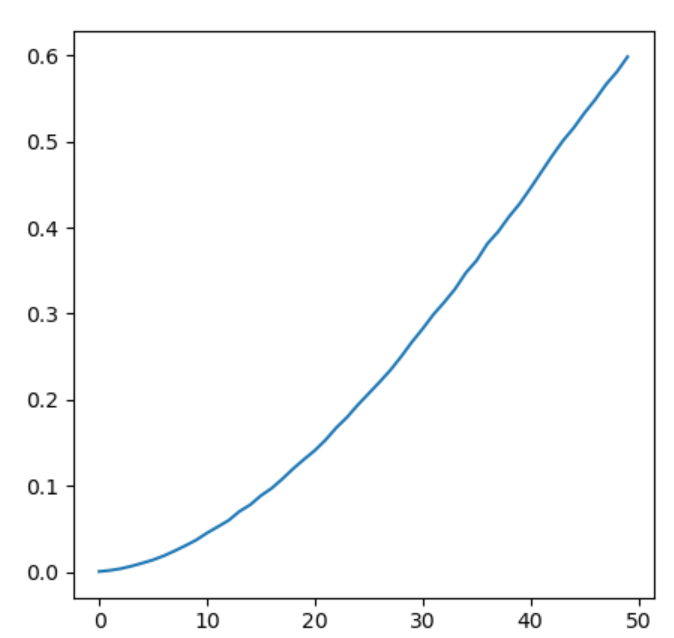
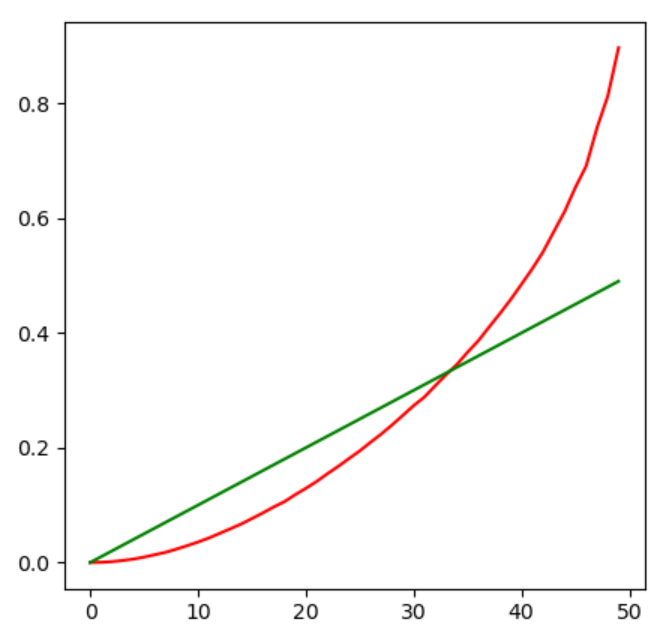
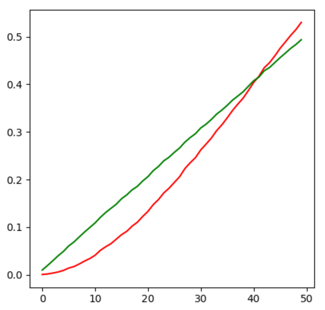
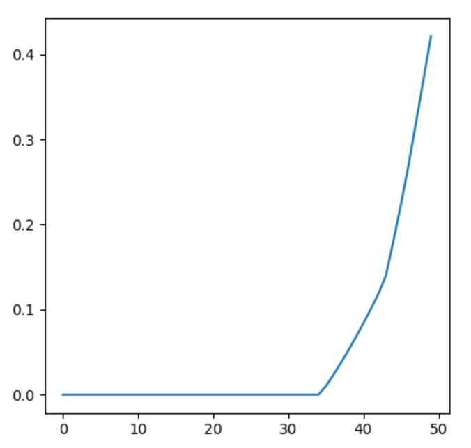
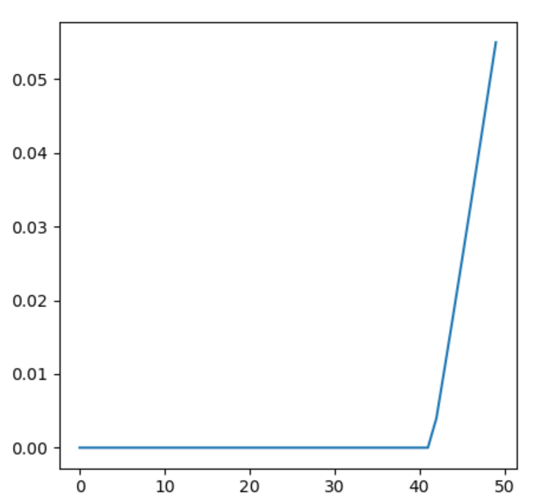
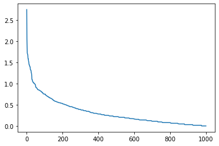

# Projet cryptofinance A5

Ce projet s'inscrit dans le cadre du cours de 5ème année donné par M.GRUNSPAN à l'ESILV. Réalisé par Quentin GIBON.

## Introduction
Sur ce repos, vous trouverez 4 algorithmes reproduisant différentes stratégies de minage sur la blockchain bitcoin. L'objectif est d'analyser les résultats de gains obtenus afin de determiner l'efficacité de ces stratégies.
Sont donc implémentés les algorithmes suivants :
  - Attaque à la double dépense (doubleSpending.py)
  - Minage optimale (minageOptimal.py)
  - Selfish mining (selfishQ.py)
  - Stratégie dite "un plus deux" (onePlusTwo.py)

Est aussi inclu un script implémentant une interface graphique simple permettant d'interagir avec ces différents algorithmes et faire ses propres simulations.

 

## Utilisation de l'IHM

L'interface graphique est implémentée dans le script IHM.py. Simplement clonez ce repository, et lancez ce script python.
Au lancement, une fenêtre avec un petit menu s'affiche. Vous pouvez selectionner l'algorithme que vous désirez. Une autre fenêtre s'ouvre alors dans laquelle vous pourrez paramétrer et lancer votre propre simulation. Les résultats sont généralement accompagnés d'un graphique montrant le gain en fonction de la puissance de calcul de l'attaquant.

 

## Présentation et analyse des résultats
A partir des résultats obtenus, on va tenter de déterminer l'efficacité des différentes attaques. Nous allons extraire les seuils de puissance de calcul relatifs à partir desquels un attaquant est profitable. Nous plaçons donc la puissance de calcul q dans l'interval de définition 0 < q < 1/2.

### Double dépense
Lors de cette attaque, un mineur malveillant effectue un paiement puis tente en secret de valider une deuxième transaction conflictuelle dans un nouveau bloc, de la même de la même adresse, mais vers une nouvelle adresse qu'il contrôle, ce qui lui lui permet de récupérer les fonds.
Un certain nombre de paramètres sont à prendre en compte :
- Number of confirmations z : le nombre de confirmations pour la transaction
- Relative hasrate of the attacker q : la puissance de hashage relative de l'attaquant
- Amount of the double spend v : le montant de la transaction que l'on essaie de double dépenser
- Maximum delay authorized A :  la valeur l'écart que l'on autorise entre la blockchain officielle et la chaine de l'attaquant
- Number of cycles n : le nombre de cyles dans l'attaque

Avec z=2, v=1, A=3 on obtient le graphe suivant :

Avec de tels paramètres, l'attaquant est profitable à partir de **37%** de la puissance de hashage au total environ.

### Selfish mining
Cette attaque se produit lorsqu'un individu dans une pool de minage tente d'empêcher la diffusion d'un bloc validé avec succès au reste du réseau de la pool. Une fois que le mineur égoïste a trouvé et retient son bloc validé au groupe, il continue à miner le bloc suivant, ce qui lui permet de démontrer plus de preuves de travail que les autres mineurs de la pool de minage.
Les seuls paramètres ici sont la puissance de hashage relative alpha de l'attaquant et le nombre de simulation executés n.

Pour n=10^6 simulations on obtient le graphique suivant :

Cette attaque semble suivre une loi de poisson. D'après nos résultats, l'attaquant semble être profitable à partir **34%** de la puissance de hashage au total environ.

### Un + deux
Lors de cette technique de minage, un attaquant essaie, sur des cycles de 3 blocs, de découvrir le plus de bloc que son adversaire et donc pouvoir ajouter ses blocs découvert à la chaine officielle à l'issue d'un cycle.
Comme pour le selfish mining, les seuls paramètres ici sont la puissance de hashage relative alpha de l'attaquant et le nombre de simulation executés n.

Pour n=10^6 simulations on obtient le graphique suivant :

D'après nos résultats, l'attaquant semble être profitable à partir **42%** de la puissance de hashage au total environ.

### Minage optimale
Cette technique a pour objectif de maximiser le gain d'un attaquant au cours d'un cycle qui prend fin dès que n blocs ont été découverts.
Un certain nombre de paramètres sont à prendre en compte :
- a : Nombre de blocs secrets découverts
- h : taille de la blockchain officielle
- n : nombre maximal de blocs découverts (taille d'un cycle)
- q : puissance de hashage relative de l'attaquant
- c : coût du minage versé par l'attaquant

On est alors en mesure de modeliser cette fonction d'espérance de gain en fonction de la puissance de hashage de l'attaquant par un graphe. La courbe ci dessous de cette fonction est réalisée pour a=0, h=0, n=10 et c=q :

On remarque que l'attaquant ne peut espérer commencer à être rémunéré qu'au dessus de q=0.34 environ (**34%** de la puissance de calcul).

Même graphe pour a=0, h=0, n=3 et c=q :

On remarque que l'attaquant ne commence à être rémunéré qu'au dessus de q=$\sqrt{2}$-1 (environ **41~42%** de la puissance de calcul).

D'après nos résultat cette fonction d'ésperance de gain semble suivre une loi normale de variance n.

 

## Conclusion
Nous avons présenté différentes techniques de minage plus ou moins profitables sur la blockchain bitcoin. La technique de minage optimale nous permet de mieux modéliser la profitabilité selon un plus grand nombre de paramètres. A paramètres égaux par exemple, on retrouve le résultat de la technique la plus efficace des trois autres, à savoir **le selfish mining avec une profitabilité positive à partir 34% de la puissance de hashage au total** environ.

 

## Bonus - Proof of Work
En bonus on fournit une simple analyse de l'algorithme de proof of work sur bitcoin. Le script de l'algorithme est intitulé PoW.py .

En faisant tourner cet algorithme, on peut afficher un graphique permettant de modeliser l'évolution du temps de calcul d'un hash dans le cadre d'un proof of work.

On obtient la courbe d'une fonction inversement exponentielle.